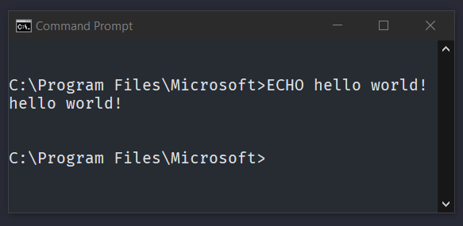
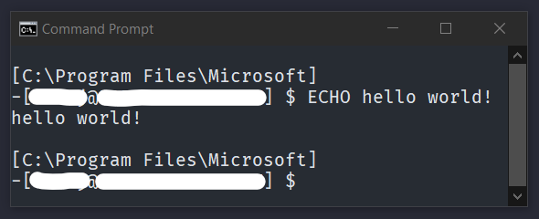
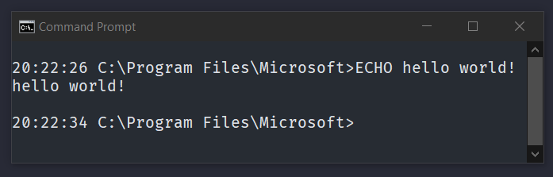
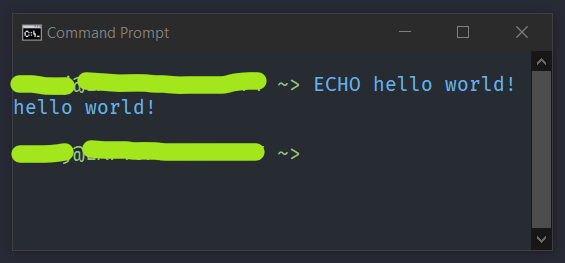
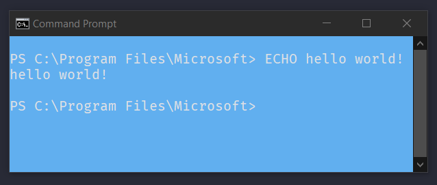
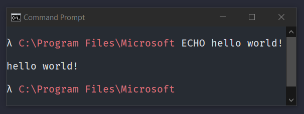
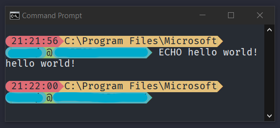
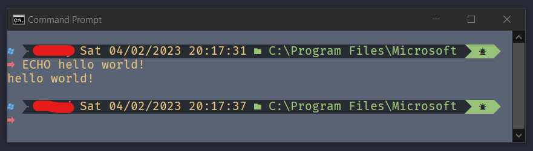
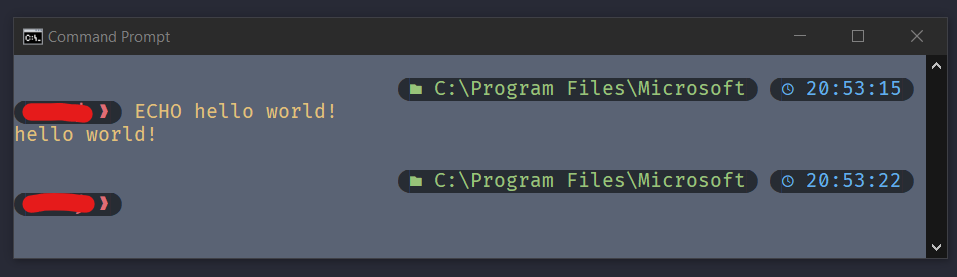

# Example Input Prompt Designs #

## Basic Prompt Without Text Formatting Or Powerline Characters ##

1. Display the UNC path whenever you are using a network drive (mapped with NET USE) and then on the next line the default prompt:  
         > `NETWORK_DRIVES ENTER DEFAULT`  
         

2. A HP-UX style prompt with the computername and the current folder on separate lines:  
         > `[ CURRENT_DRIVE_AND_PATH ] ENTER -[ USER_NAME @ COMPUTER_NAME ] SPACE $$ SPACE`  
          

3. Display the time, backspacing to hide the milliseconds with the default prompt afterwards:  
         > `CURRENT_TIME CURSOR_LEFT:<3> SPACE DEFAULT`  
         

## With Text Formatting ##

1. HP-UX style prompt with username at computer name and then the path with a green theme:  
          > `CYAN_FG [ GREEN_FG USER_NAME WHITE_FG @ BOLD_GREEN_FG COMPUTER_NAME BLUE_FG SPACE CURRENT_DRIVE_AND_PATH CYAN_FG ] SPACE BOLD_WHITE_FG $$ SPACE GREEN_FG`  
          

2. A Fish Shell style prompt with the username at computername and then a squiggly arrow and blue command text:  
          > `ADD_BRIGHT_FG BOLD_GREEN_FG USER_NAME DEFAULT_FORMAT GREEN_FG ADD_ITALICS @ DEFAULT_FORMAT GREEN_FG COMPUTER_NAME SPACE ~ GREATER_THAN SPACE BLUE_FG`  
          

3. A Powershell like command prompt, you should also call `COLOR 1F` or change the fg and bg colors in your CMD's properties:  
          > `BLUE_BG WHITE_FG PS SPACE CURRENT_DRIVE_AND_PATH > SPACE`  
          

4. A Oh-My-Posh basic Lambda theme that shows lambda and then the path in red:
          > `BOLD_WHITE_FG λ SPACE BOLD_RED_FG CURRENT_DRIVE_AND_PATH SPACE WHITE_FG CURSOR_SHAPE_BLINKING_BLOCK` 
           

## With Powerline Characters And Text Formatting ##

1. Displays the time (without miliseconds), then the directory path, and on the second line it has the user's name and then the user domain (computer name) and all with colors and powerline characters:  
          > `RED_FG L_F_CIRCLE RED_BG BLACK_FG CURRENT_TIME CURSOR_LEFT:<3> YELLOW_BG RED_FG R_F_TRIANGLE YELLOW_BG BLACK_FG CURRENT_DRIVE_AND_PATH YELLOW_FG DEFAULT_BG R_F_TRIANGLE ENTER CYAN_FG L_F_CIRCLE CYAN_BG BLACK_FG USER_NAME GREEN_BG CYAN_FG R_F_CIRCLE BLACK_FG GREEN_BG @ CYAN_FG L_F_CIRCLE CYAN_BG BLACK_FG USER_DOMAIN CYAN_FG DEFAULT_BG R_F_TRIANGLE DEFAULT_FORMAT SPACE`  
          

2. A style based off of the Oh-My-Posh Microverse-Power style, you will have to call `COLOR 86` or set the fg to grey in your CMD's properties:
         > `BLUE_FG  SPACE BLACK_FG L_F_BLOCK BLACK_BG BOLD_RED_FG SPACE USER_NAME BOLD_YELLOW_FG SPACE CURRENT_DATE SPACE CURRENT_TIME CURSOR_LEFT:<3> SPACE BOLD_GREEN_FG  SPACE CURRENT_DRIVE_AND_PATH SPACE BLACK_FG GREEN_BG R_F_TRIANGLE SPACE ﲍ SPACE DEFAULT_BG GREEN_FG R_F_TRIANGLE ENTER RED_FG ➡ SPACE YELLOW_FG`  
         

3. A prompt based off of the Oh-My-Posh Bubblesextra theme, you will have to call `COLOR 86` or set the fg to grey in your CMD's properties:
         > `CURSOR_FORWARD_TAB:<4> BLACK_FG L_F_CIRCLE BLACK_BG BOLD_GREEN_FG  SPACE CURRENT_DRIVE_AND_PATH DEFAULT_BG BLACK_FG R_F_CIRCLE DEFAULT_FG SPACE BLACK_FG L_F_CIRCLE BLACK_BG BOLD_BLUE_FG  SPACE CURRENT_TIME BACKSPACE BACKSPACE BACKSPACE BLACK_FG DEFAULT_BG R_F_CIRCLE DEFAULT_FORMAT SPACE SPACE ENTER BLACK_FG L_F_CIRCLE BLACK_BG BOLD_RED_FG USER_NAME SPACE ❱ BLACK_FG DEFAULT_BG R_F_CIRCLE SPACE YELLOW_FG`  
         
