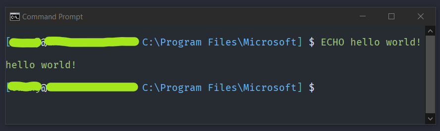

# Example Input Prompt Designs #

## Basic Prompt Without Text Formatting Or Powerline Characters ##

1. Display the UNC path whenever you are using a network drive (mapped with NET USE) and then on the next line the default prompt:  
         > `NETWORK_DRIVES ENTER DEFAULT`  
         

2. A HP-UX style prompt with the computername and the current folder on separate lines:  
         > `[ CURRENT_DRIVE_AND_PATH ] ENTER -[ USER_NAME @ COMPUTER_NAME ] SPACE $$ SPACE`  
          

3. Display the time, backspacing to hide the milliseconds with the default prompt afterwards:  
         > `CURRENT_TIME CURSOR_LEFT:<3> SPACE DEFAULT`  
         

## With Text Formatting ##

1. HP-UX style prompt with username at computer name and then the path with a green theme:  
          > `FG_CYAN [ FG_GREEN USER_NAME FG_WHITE @ FG_BRIGHT_GREEN COMPUTER_NAME FG_BLUE SPACE CURRENT_DRIVE_AND_PATH FG_CYAN ] SPACE FG_BRIGHT_WHITE $$ SPACE FG_GREEN`  
          

2. A Fish Shell style prompt with the username at computername and then a squiggly arrow and blue command text:  
          > `BOLD FG_BRIGHT_GREEN USER_NAME NORMAL FG_GREEN ITALIC @ NORMAL FG_GREEN COMPUTER_NAME SPACE ~ GREATER_THAN SPACE FG_BLUE`  
          

3. A Powershell like command prompt, you should also call `COLOR 1F` or change the fg and bg colors in your CMD's properties:  
          > `BG_BLUE FG_WHITE PS SPACE CURRENT_DRIVE_AND_PATH > SPACE`  
          

4. A Oh-My-Posh basic Lambda theme that shows lambda and then the path in red:
          > `FG_BRIGHT_WHITE λ SPACE FG_BRIGHT_RED CURRENT_DRIVE_AND_PATH SPACE FG_WHITE CURSOR_SHAPE_BLINKING_BLOCK` 
           

## With Powerline Characters And Text Formatting ##

1. Displays the time (without miliseconds), then the directory path, and on the second line it has the user's name and then the user domain (computer name) and all with colors and powerline characters:  
          > `FG_RED L_F_CIRCLE BG_RED FG_BLACK CURRENT_TIME CURSOR_LEFT:<3> BG_YELLOW FG_RED R_F_TRIANGLE BG_YELLOW FG_BLACK CURRENT_DRIVE_AND_PATH FG_YELLOW BG_DEFAULT R_F_TRIANGLE ENTER FG_CYAN L_F_CIRCLE BG_CYAN FG_BLACK USER_NAME BG_GREEN FG_CYAN R_F_CIRCLE FG_BLACK BG_GREEN @ FG_CYAN L_F_CIRCLE BG_CYAN FG_BLACK USER_DOMAIN FG_CYAN BG_DEFAULT R_F_TRIANGLE NORMAL SPACE`  
          

2. A style based off of the Oh-My-Posh Microverse-Power style, you will have to call `COLOR 86` or set the fg to grey in your CMD's properties:
         > `FG_BLUE  SPACE FG_BLACK L_F_BLOCK BG_BLACK FG_BRIGHT_RED SPACE USER_NAME FG_BRIGHT_YELLOW SPACE CURRENT_DATE SPACE CURRENT_TIME CURSOR_LEFT:<3> SPACE FG_BRIGHT_GREEN  SPACE CURRENT_DRIVE_AND_PATH SPACE FG_BLACK BG_GREEN R_F_TRIANGLE SPACE ﲍ SPACE BG_DEFAULT FG_GREEN R_F_TRIANGLE ENTER FG_RED ➡ SPACE FG_YELLOW`  
         

3. A prompt based off of the Oh-My-Posh Bubblesextra theme, you will have to call `COLOR 86` or set the fg to grey in your CMD's properties:
         > `CURSOR_FORWARD_TAB:<4> FG_BLACK L_F_CIRCLE BG_BLACK FG_BRIGHT_GREEN  SPACE CURRENT_DRIVE_AND_PATH BG_DEFAULT FG_BLACK R_F_CIRCLE FG_DEFAULT SPACE FG_BLACK L_F_CIRCLE BG_BLACK FG_BRIGHT_BLUE  SPACE CURRENT_TIME BACKSPACE BACKSPACE BACKSPACE FG_BLACK BG_DEFAULT R_F_CIRCLE NORMAL SPACE SPACE ENTER FG_BLACK L_F_CIRCLE BG_BLACK FG_BRIGHT_RED USER_NAME SPACE ❱ FG_BLACK BG_DEFAULT R_F_CIRCLE SPACE FG_YELLOW`  
         
